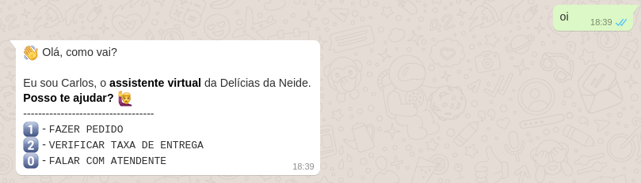
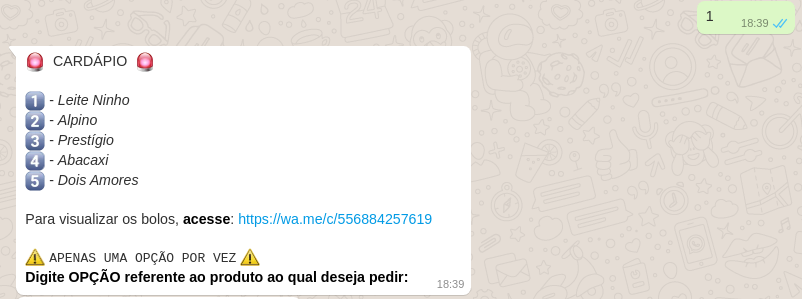
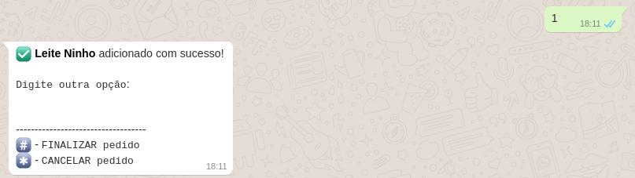
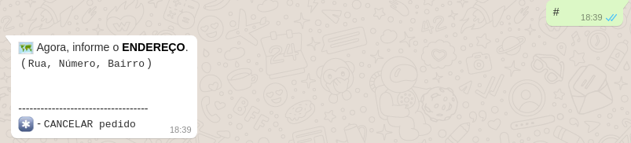
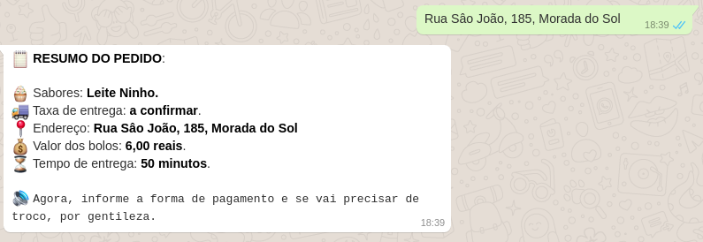

# Whasapp Bot with VENOM-BOT
## Descrição do Projeto.

<h1 align="center">
    <a href="https://nodejs.org/en/">🔗 NodeJS</a>
    <a href="https://www.npmjs.com/package/venom-bot">🧠 Venom Bot</a>
</h1>

🚀 Projeto criado com o intuito de auxiliar nas demandas de pedidos da empresa "Delícias da Neide" via WhatsApp.

 
<h1 align="center">
  Welcome
  
  Menu
  
  Order
  
  Address
  
  Bill
  
  Assistant
  
</h1>